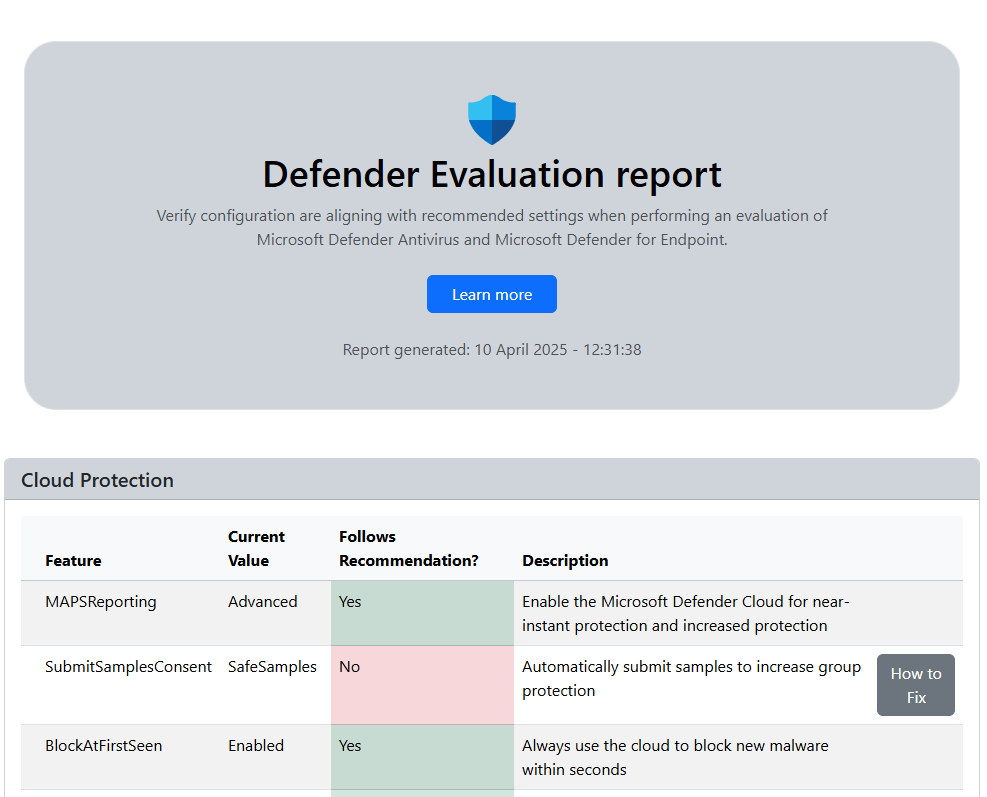

# Verify configuration for a Microsoft Defender for Endpoint evaluation

Generates a report to check whether Defender Antivirus and Defender for Endpoint features are configured according to recommended settings for product evaluation scenarios, such as internal red-teaming exercises.

* https://learn.microsoft.com/en-us/defender-endpoint/evaluate-microsoft-defender-antivirus

## Installation Steps

Install the module from the PowerShell Gallery by running:

`Install-Module DefenderEval`

The current PowerShell execution policy can be verified by running `Get-ExecutionPolicy`. If it is not set to RemoteSigned or Unrestricted, it can be set to RemoteSigned by running the following:

`Set-ExecutionPolicy -ExecutionPolicy RemoteSigned -Scope CurrentUser`

After installation of the module, run the following as an Administrator to generate the report:

`Get-DefenderEvaluationReport`